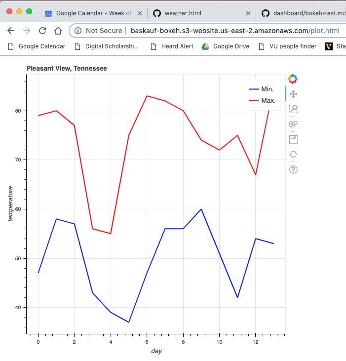

# Notes on failed test to deploy Bokeh in an AWS lambda 2019-04-29

## Bokeh quickstart

I started here: https://bokeh.pydata.org/en/latest/docs/user_guide/quickstart.html#userguide-quickstart

and used their code example to create an HTML page.  

The output processing is determined by the command for the results.  In the example, it's `show()`, but for output to a file it needs to be `save()`.  See https://bokeh.pydata.org/en/latest/docs/reference/io.html#bokeh-io for info on the save command.  The challenge here is to actually output to an S3 bucket while the `save()` function outputs to the file system. 

## writing to the filesystem

This StackOverflow question asks about how to do that https://stackoverflow.com/questions/55071809/location-of-bokeh-plot-output-following-aws-lambda-function, which references this page: https://stackoverflow.com/questions/35006874/how-do-you-write-to-the-file-system-of-an-aws-lambda-instance .  Unfortunately, it's a Javascript example.   Nevertheless, it doesn't seem too hard to access the `/temp` directory of the local file system, as indicated here: https://stackoverflow.com/questions/35641994/accessing-local-filesystem-in-aws-lambda/35642189 and even more simply here: https://apassionatechie.wordpress.com/2018/01/21/write-to-tmp-directory-in-aws-lambda-with-python/ 

I was able to read and write in this test lambda:

```python
import os

def lambda_handler(event, context):
    os.chdir('/tmp')
    someText = "Goin' into the file!"
    with open('datafile.txt', 'wt', encoding='utf-8') as fileObject:
        fileObject.write(someText)
    
    with open('datafile.txt', 'rt', encoding='utf-8') as fileObject:
        lineList = fileObject.read()
    print(lineList)
```

In theory, one can change to the tmp directory as in the example, let Bokeh write to the file, then load the HTML file as in the example above and save the text into the S3 bucket.  

## Uploading the Bokeh module

**IMPORTANT NOTE: Do not call your script `bokeh.py`.  If you do, it will generate an error because that's the name of the package it has to read.  Call it something else!**

Since Bokeh isn't part of the standard AWS library, it will have to be uploaded as part of a .zip file.  Initially, I downloaded the entire thing, including all of the dependencies, using 

```
pip install bokeh -t ~/temp
```

I then added the stub Python lambda to the directory, zipped it up, then uploaded using this AWS CLI command:

```
aws lambda create-function --region us-east-2 --function-name bokeh --zip-file fileb://bokeh.zip --role arn:aws:iam::555751041262:role/lambda_s3_access --handler bokeh.lambda_handler --runtime python3.6 --memory-size 512
```

However, it was too big to edit online and it failed with no real way for me to troubleshoot.  

However, some of the dependencies like numpy are now part of the AWS standard library.  I found one example of somebody actually trying to use Bokeh: https://stackoverflow.com/questions/54542060/aws-lambda-layer-for-bokeh .  It involved using AWS "layers", which is apparently a new thing.  See this post: https://medium.com/@qtangs/creating-new-aws-lambda-layer-for-python-pandas-library-348b126e9f3e for more on that.  Unfortunately, I haven't seen that anybody has already created a layer for Bokeh: https://github.com/mthenw/awesome-layers .  It looks like I might be able to follow the first StackOverflow to build the layer, or maybe install Bokeh by creating a zip that doesn't include all of the dependencies.  

Did that - it was pretty simple.  I just created the 'requirements.txt' file, then ran the get_layer_packages.sh shell script to created the layer. Packaged the "python" directory as a .zip file.  

I then followed the directions under "Managing Layers" at https://docs.aws.amazon.com/lambda/latest/dg/configuration-layers.html .  I used the command

```
aws lambda publish-layer-version --layer-name bokeh-layer --description "Bokeh layer" --license-info "MIT" \
--content S3Bucket=baskauf-bokeh,S3Key=python.zip --compatible-runtimes python3.6
```

The creation was successful and I got this result:
```
"LayerArn": "arn:aws:lambda:us-east-2:555751041262:layer:bokeh-layer"
"LayerVersionArn": "arn:aws:lambda:us-east-2:555751041262:layer:bokeh-layer:1"
"Description": "Bokeh layer"
```

Now, try re-creating the function using the layer instead of including all of the packages in the zip:

```
aws lambda create-function --region us-east-2 --function-name bokeh-test --zip-file fileb://bokeh-test.zip --role arn:aws:iam::555751041262:role/lambda_s3_dynamodb_cloudwatch_baskauf --handler bokeh-test.lambda_handler --runtime python3.6 --memory-size 512 --layers arn:aws:lambda:us-east-2:259788987135:layer:AWSLambda-Python36-SciPy1x:2 arn:aws:lambda:us-east-2:555751041262:layer:bokeh-layer:1
```

I could see that it was successful by clicking on `Layers` under the lambda name in the GUI. 

In order to get this to work, I had to add the layer arn:aws:lambda:us-east-2:259788987135:layer:AWSLambda-Python36-SciPy1x:2 so that I would have numpy (a dependency of bokeh).  Not sure whether the merge order matters (since bokeh depends on numpy and not the other way around).

## Making a script that will save a plot

I modified the earlier script to this:

```python
import os
import numpy as np
from bokeh.plotting import figure, output_file, save

def lambda_handler(event, context):
    os.chdir('/tmp')

    # prepare some data
    N = 4000
    x = np.random.random(size=N) * 100
    y = np.random.random(size=N) * 100
    radii = np.random.random(size=N) * 1.5
    colors = [
        "#%02x%02x%02x" % (int(r), int(g), 150) for r, g in zip(50+2*x, 30+2*y)
    ]
    
    # output to static HTML file (with CDN resources)
    output_file("color_scatter.html", title="color_scatter.py example", mode="cdn")
    
    TOOLS = "crosshair,pan,wheel_zoom,box_zoom,reset,box_select,lasso_select"
    
    # create a new plot with the tools above, and explicit ranges
    p = figure(tools=TOOLS, x_range=(0, 100), y_range=(0, 100))
    
    # add a circle renderer with vectorized colors and sizes
    p.circle(x, y, radius=radii, fill_color=colors, fill_alpha=0.6, line_color=None)
    
    # save the results
    save(p, filename='plot.html', title='My data')

    with open('plot.html', 'rt', encoding='utf-8') as fileObject:
        lineList = fileObject.read()
    print(lineList)
```

This worked to save the plot output into the local filesystem and I was able to see the lines of the HTML in the CloudWatch log.

Next step, move the file to an S3 bucket.

```python
import os
import boto3
import numpy as np
from bokeh.plotting import figure, output_file, save

def lambda_handler(event, context):
    os.chdir('/tmp')

    # prepare some data
    N = 4000
    x = np.random.random(size=N) * 100
    y = np.random.random(size=N) * 100
    radii = np.random.random(size=N) * 1.5
    colors = [
        "#%02x%02x%02x" % (int(r), int(g), 150) for r, g in zip(50+2*x, 30+2*y)
    ]
    
    # output to static HTML file (with CDN resources)
    output_file("color_scatter.html", title="color_scatter.py example", mode="cdn")
    
    TOOLS = "crosshair,pan,wheel_zoom,box_zoom,reset,box_select,lasso_select"
    
    # create a new plot with the tools above, and explicit ranges
    p = figure(tools=TOOLS, x_range=(0, 100), y_range=(0, 100))
    
    # add a circle renderer with vectorized colors and sizes
    p.circle(x, y, radius=radii, fill_color=colors, fill_alpha=0.6, line_color=None)
    
    # save the results
    save(p, filename='plot.html', title='My data')

    with open('plot.html', 'rt', encoding='utf-8') as fileObject:
        outString = fileObject.read()

    bucket_name = 'baskauf-bokeh'
    file_name = 'plot.html'
    folder = ''
    s3_path = folder + file_name

    s3 = boto3.resource("s3")
    s3.Bucket(bucket_name).put_object(Key=s3_path, Body=outString, ContentType='text/html')
```

To get the output file to be viewable in a browser, I did several things:
- on the bucket level, I enabled static web hosting.
- on the bucket level, I had to edit the Public access settings to change "Manage public bucket policies": Block new public bucket policies=False and Block public and cross-account access if bucket has public policies=False.
- that then allowed me on a bucket level to go to the Bucket Policy and edit the policy to the following:

```json
{
    "Version": "2012-10-17",
    "Statement": [
        {
            "Sid": "PublicReadGetObject",
            "Effect": "Allow",
            "Principal": "*",
            "Action": "s3:GetObject",
            "Resource": "arn:aws:s3:::baskauf-bokeh/*"
        }
    ]
}
```

Then on the file level, I went to Properties, Metadata and changed the key: Content-Type to value: text/html .  

That allowed viewing the file at this URL:

http://baskauf-bokeh.s3-website.us-east-2.amazonaws.com/plot.html

However, when I re-ran the file, the content type got changed back again and the browser downloaded the file instead of displaying it.  I fixed this by adding a parameter `, ContentType='text/html'` to the `.put_object()` method.

## Trigger the Lambda on DynamoDB MODIFY event

To retrieve all items from a DynamoDB table, use the .scan() method. Using it with no attributes produces JSON like this:

```json
{
    "Items": [
            {"max": "67.0", "ppt": "0.0", "isoDate": "2019-04-28", "min": "54.0"}, 
            {"max": "83.0", "ppt": "0.0", "isoDate": "2019-04-22", "min": "47.0"}, 
            {"max": "75.0", "ppt": "0.01", "isoDate": "2019-04-21", "min": "37.0"}, 
            {"max": "80.0", "ppt": "0.03", "isoDate": "2019-04-17", "min": "58.0"}, 
            {"max": "75.0", "ppt": "0.05", "isoDate": "2019-04-27", "min": "42.0"}, 
            {"max": "79.0", "ppt": "0.0", "isoDate": "2019-04-16", "min": "47.0"}, 
            {"max": "82.0", "ppt": "0.0", "isoDate": "2019-04-23", "min": "56.0"}, 
            {"max": "80.0", "ppt": "0.0", "isoDate": "2019-04-24", "min": "56.0"}, 
            {"max": "55.0", "ppt": "0.64", "isoDate": "2019-04-20", "min": "39.0"}, 
            {"max": "85.0", "ppt": "0.0", "isoDate": "2019-04-29", "min": "53.0"}, 
            {"max": "77.0", "ppt": "1.17", "isoDate": "2019-04-18", "min": "57.0"}, 
            {"max": "72.0", "ppt": "0.01", "isoDate": "2019-04-26", "min": "51.0"}, 
            {"max": "56.0", "ppt": "0.91", "isoDate": "2019-04-19", "min": "43.0"}, 
            {"max": "74.0", "ppt": "0.07", "isoDate": "2019-04-25", "min": "60.0"}
        ], 
    "Count": 14, 
    "ScannedCount": 14, 
    "ResponseMetadata": {
        "RequestId": "0MBS1U09SH9SK4BR046NUJO95JVV4KQNSO5AEMVJF66Q9ASUAAJG", 
        "HTTPStatusCode": 200, 
        "HTTPHeaders": {
            "server": "Server", 
            "date": "Tue, 30 Apr 2019 18:02:35 GMT", 
            "content-type": "application/x-amz-json-1.0", 
            "content-length": "1266", 
            "connection": "keep-alive", 
            "x-amzn-requestid": "0MBS1U09SH9SK4BR046NUJO95JVV4KQNSO5AEMVJF66Q9ASUAAJG", 
            "x-amz-crc32": "1377834137"
            }, 
        "RetryAttempts": 0
        }
}
```

Note: there is a 1 MB limit for the scan results, so the scan should be restricted if the database is big.

Here's code that plots the minimum temperature by day index:

```python
import os
import boto3
import numpy as np
from bokeh.plotting import figure, output_file, save

# instantiate outside of handler to allow it to be accessible to the lambda for the lambda's lifetime
dynamodb = boto3.resource('dynamodb')

def lambda_handler(event, context):
    os.chdir('/tmp')
    
    table = dynamodb.Table('weatherRecords')
    response = table.scan()
    items = response["Items"]
    
    x=[]
    y=[]
    for index in range(len(items)):
        x.append(index)
        y.append(float(items[index]['min']))
    
    # output to static HTML file
    output_file("lines.html")
    
    # create a new plot with a title and axis labels
    p = figure(title="Pleasant View, Tennessee", x_axis_label='day', y_axis_label='temperature')
    
    # add a line renderer with legend and line thickness
    p.line(x, y, legend="Min.", line_width=2)
    
    # save the results
    save(p, filename='plot.html', title='weather data')

    with open('plot.html', 'rt', encoding='utf-8') as fileObject:
        outString = fileObject.read()

    bucket_name = 'baskauf-bokeh'
    file_name = 'plot.html'
    folder = ''
    s3_path = folder + file_name

    s3 = boto3.resource("s3")
    s3.Bucket(bucket_name).put_object(Key=s3_path, Body=outString, ContentType='text/html')
```

Modify script to plot both max and min in different colors. The sort function is needed since the database export is random.

```python
import os
import boto3
import numpy as np
from bokeh.plotting import figure, output_file, save

# instantiate outside of handler to allow it to be accessible to the lambda for the lambda's lifetime
dynamodb = boto3.resource('dynamodb')

def sortFunction(x):
    return x['isoDate']

def lambda_handler(event, context):
    os.chdir('/tmp')
    
    table = dynamodb.Table('weatherRecords')
    response = table.scan()
    items = response["Items"]
    items.sort(key=sortFunction)
    
    x=[]
    y=[]
    z=[]
    for index in range(len(items)):
        x.append(index)
        y.append(float(items[index]['min']))
        z.append(float(items[index]['max']))
    
    # output to static HTML file
    output_file("lines.html")
    
    # create a new plot with a title and axis labels
    p = figure(title="Pleasant View, Tennessee", x_axis_label='day', y_axis_label='temperature')
    
    # add a line renderer with legend and line thickness
    p.line(x, y, legend="Min.", line_color="blue", line_width=2)
    p.line(x, z, legend="Max.", line_color="red", line_width=2)
    
    # save the results
    save(p, filename='plot.html', title='weather data')

    with open('plot.html', 'rt', encoding='utf-8') as fileObject:
        outString = fileObject.read()

    bucket_name = 'baskauf-bokeh'
    file_name = 'plot.html'
    folder = ''
    s3_path = folder + file_name

    s3 = boto3.resource("s3")
    s3.Bucket(bucket_name).put_object(Key=s3_path, Body=outString, ContentType='text/html')
```

## Triggering the lambda by a database change

Originally, I created the role `lambda_s3_dynamodb_cloudwatch_baskauf` with AWS managed policies: AmazonS3FullAccess, AWSOpsWorksCloudWatchLogs, and a generic read-all policy for DynamoDB.  But that DynamoDB policy allowed a bunch of weird things, but didn't allow the four actions that were actually needed for the trigger.  I created a new policy `baskauf_read_all_dynamodb` that included all read functions.

That allowed me to manually set DynamoDB as the trigger with "weatherRecords" as the triggering table.  At this point, I didn't have it use any of the data passed in through the event parameter, since it will just always load the whole table.

I'm not sure how to use the CLI to associate the trigger with the lambda.  I think this page:

https://docs.aws.amazon.com/cli/latest/reference/lambda/create-event-source-mapping.html

may have the instructions.  I think it's this:

```
aws lambda create-event-source-mapping --event-source-arn <value> --function-name <value>
```

but I haven't tried it.

Here's sample output:



It can be compared with the current graph at http://baskauf-bokeh.s3-website.us-east-2.amazonaws.com/plot.html 
